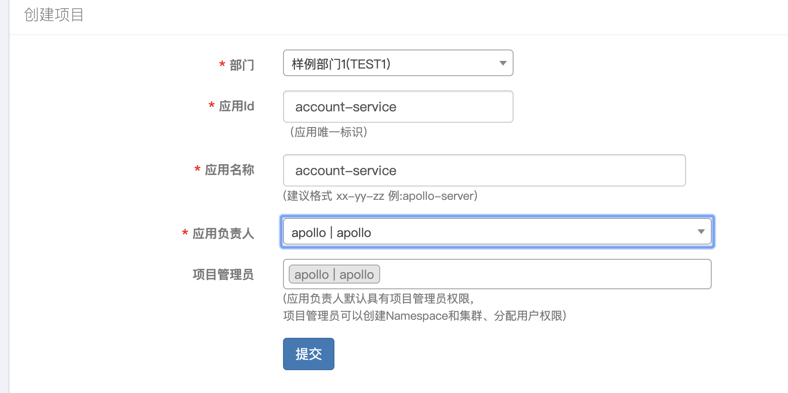

* Eureka
* Zuul
* Ribbon
* Hystrix
* Apollo
* Gravitee
* Prometheus
* Skywalking

### 准备环境

1. Apollo
* 启动mysql
   ```text
    docker run --name apollo-mysql -p 3306:3306 -e MYSQL\_ROOT\_PASSWORD=root -d mysql:5.6.45
   ```

* 执行sql脚本

  ```
  depend/apollo/apollo-build-scripts/sql/apolloconfigdb.sql
  depend/apollo/apollo-build-scripts/sql/apolloportaldb.sql
  ```

* 启动apollo

  ```text
  depend/apollo/apollo-build-scripts/demo.sh start
  ```

* 添加服务依赖配置

  ```
  访问localhost:8070
  用户名: apollo
  密码：admin
  
  将config下的配置，录入apollo中
  ```

  

 

2. 启动MongoDB

   ```
   docker run -p 27017:27017 -v $PWD/db:/data/db -d mongo:4.2
   ```


* 下载MongoDB管理工具Robo 3T： https://robomongo.org/download

* 导入基础数据

```
use admin
show dbs

db.createUser({user: "admin", pwd: "admin", 
  roles:[{role: "userAdminAnyDatabase", db: "admin"}], 
  mechanisms:[  
  "SCRAM-SHA-1"
 ]})

 
use piggymetrics_account_db
db.user2.insert({"test":"12345678"})
db.createUser({user: "user2", pwd: "test", 
  roles:[{role: "readWrite", db: "piggymetrics_account_db"}], 
  mechanisms:[  
  "SCRAM-SHA-1"
 ]})
 
 use piggymetrics_notification_db
db.user3.insert({"test":"12345678"})
db.createUser({user: "user3", pwd: "test", 
  roles:[{role: "readWrite", db: "piggymetrics_notification_db"}], 
  mechanisms:[  
  "SCRAM-SHA-1"
 ]})
 
 use piggymetrics_statistics_db
db.user4.insert({"test":"12345678"})
db.createUser({user: "user4", pwd: "test", 
  roles:[{role: "readWrite", db: "piggymetrics_statistics_db"}], 
  mechanisms:[  
  "SCRAM-SHA-1"
 ]})

 
 use piggymetrics_account_db;
print('dump start');

db.accounts.update(
    { "_id": "demo" },
    {
    "_id": "demo",
    "lastSeen": new Date(),
    "note": "demo note",
    "expenses": [
        {
            "amount": 1300,
            "currency": "USD",
            "icon": "home",
            "period": "MONTH",
            "title": "Rent"
        },
        {
            "amount": 120,
            "currency": "USD",
            "icon": "utilities",
            "period": "MONTH",
            "title": "Utilities"
        },
        {
            "amount": 20,
            "currency": "USD",
            "icon": "meal",
            "period": "DAY",
            "title": "Meal"
        },
        {
            "amount": 240,
            "currency": "USD",
            "icon": "gas",
            "period": "MONTH",
            "title": "Gas"
        },
        {
            "amount": 3500,
            "currency": "EUR",
            "icon": "island",
            "period": "YEAR",
            "title": "Vacation"
        },
        {
            "amount": 30,
            "currency": "EUR",
            "icon": "phone",
            "period": "MONTH",
            "title": "Phone"
        },
        {
            "amount": 700,
            "currency": "USD",
            "icon": "sport",
            "period": "YEAR",
            "title": "Gym"
        }
    ],
    "incomes": [
        {
            "amount": 42000,
            "currency": "USD",
            "icon": "wallet",
            "period": "YEAR",
            "title": "Salary"
        },
        {
            "amount": 500,
            "currency": "USD",
            "icon": "edu",
            "period": "MONTH",
            "title": "Scholarship"
        }
    ],
    "saving": {
            "amount": 5900,
            "capitalization": false,
            "currency": "USD",
            "deposit": true,
            "interest": 3.32
        }
    },
    { upsert: true }
);

print('dump complete');
```

3. skywalking

   * 启动es (http://localhost:9200/)

   ````
   docker run -d --restart=always -e ES_JAVA_OPTS="-Xms256m -Xmx256m" --name es -p 9200:9200 -p 9300:9300 -e "discovery.type=single-node" elasticsearch:6.8.1
   ````

   * 下载skywalking 6.4.0版本：http://skywalking.apache.org/downloads/
   * 修改webapp/webapp.yml中，8080端口为8888
   * depend/skywalking/apache-skywalking-apm-bin/bin/start.sh启动skywalking
   * http://localhost:8888/

4. gravitee

   * 安装go环境

     ```
     brew install go
     ```

   * 配置go环境

     ```
     在 ~/.bash_profile，新增如下配置：
     export GOPATH=/Users/qudian/go   #自定义路径
     export GOBIN=$GOPATH/bin
     export PATH=$PATH:$GOBIN
     
     ```

   * 在自定义路径下，新建三个文件夹：bin，src/github.com/spring2go/gravitee，pkg

   * 将depend/gravitee下所有文件，复制到src/github.com/spring2go/gravitee下

   * 启动gravitee

     ```
     ./gravitee-server runserver
     ```

5. consul

   * 启动consul

     ```
     depend/consul/consul/consul agent -dev
     ```

6. cat

   * 启动cat-mysql

     ```
     cd depend/cat/docker-mysql
     docker-compose up -d
     ```

   * 启动cat

     ```
     cd depend/cat/docker-cat
     docker-compose up -d
     ```

     

